# CloudZen AKS Architecture

```mermaid
flowchart TD
    subgraph Internet["🌐 Internet"]
        User(["👤 User"])
    end

    subgraph CF["☁️ Cloudflare (Free Tier)"]
        CFWAF["WAF + DDoS Protection"]
        CFDNS["DNS Management\n cloudzen.me\n *.system.cloudzen.me"]
    end

    subgraph GitHub["🐙 GitHub"]
        direction TB
        subgraph Repos["Repositories"]
            GITOPS["AKS-GitOps\n(Source of Truth)"]
            APPCODE["Application-Microservice-1\n(Todo App Source)"]
            FUNCCODE["Function-App\n(Task Manager Source)"]
        end
        subgraph Actions["GitHub Actions CI/CD"]
            PIPE1["build-push.yaml\nBuild → Push to ACR"]
            PIPE2["aks-start-stop.yaml\nManual Start/Stop"]
            PIPE3["aks-scheduled-stop.yml\nAuto Stop every 2hrs"]
        end
    end

    subgraph Azure["🔷 Azure (Central India)"]
        subgraph RG["Resource Group: cloudzen-prod-rg"]
            ACR["🗃️ Azure Container Registry\ncloudzenprodacr\ntodo-app:latest\ntask-manager:latest"]
            MI["🔑 Managed Identity\ncloudzen-prod-mi\n(OIDC Auth)"]
            FUNC["⚡ Azure Function App\ncloudzen-prod-function\ntask-manager container\nEP1 Premium Plan"]
            AUTO["⚙️ Automation Account\ncloudzen-prod-automation\nRotate Storage key2 every 1min"]
            SG["💾 Storage Account\ncloudzenprodsg"]

            subgraph AKS["☸️ AKS Cluster: cloudzen-prod-aks (v1.34.4)\nNode: Standard_D2pls_v6 (2vCPU/4GB)"]
                LB["⚖️ Azure Load Balancer\nPublic IP: 20.x.x.x"]

                subgraph INGRESS["nginx-ingress (ingress-nginx namespace)"]
                    NX["nginx Ingress Controller\nHost-based routing"]
                end

                subgraph ARGOCD_NS["argocd namespace"]
                    ARGOCD["🔄 ArgoCD v3.3.6\napp-of-apps pattern\nselfHeal + prune"]
                    IMGUPD["📦 Image Updater\nPolls ACR every 2min\nDigest-based updates"]
                end

                subgraph TODO_NS["todo-app namespace"]
                    TODO["📋 todo-app\nnginx:alpine\nPort 8080\n2 replicas"]
                end

                subgraph MONITORING["monitoring namespace"]
                    GRAFANA["📊 Grafana\ngrafana.system.cloudzen.me"]
                    PROM["📈 Prometheus\nprometheus.system.cloudzen.me\n(disabled by default)"]
                end
            end

            subgraph MRG["Managed Resource Group: cloudzen-prod-aks-mrg"]
                VMSS["💻 VMSS\naks-agentpool01"]
                NSG["🛡️ NSG"]
                LBMRG["⚖️ Load Balancer"]
                PIP1["🌐 Public IP #1\nLoad Balancer"]
                PIP2["🌐 Public IP #2\nnginx Ingress"]
                AGENTMI["🔑 Managed Identity\ncloudzen-prod-aks-agentpool\n(preserved on stop)"]
            end
        end
    end

    %% User traffic flow
    User -->|"http://cloudzen.me"| CFWAF
    CFWAF -->|"Proxy + Protect"| LB
    LB --> NX
    NX -->|"cloudzen.me /"| TODO
    NX -->|"argocd.system.cloudzen.me"| ARGOCD
    NX -->|"grafana.system.cloudzen.me"| GRAFANA
    NX -->|"prometheus.system.cloudzen.me"| PROM

    %% DNS
    CFDNS -->|"A record → LB IP"| LB

    %% CI/CD flow
    APPCODE --> PIPE1
    FUNCCODE --> PIPE1
    PIPE1 -->|"Push image"| ACR
    PIPE1 -->|"Deploy container"| FUNC
    PIPE2 -->|"az aks start/stop\n+ MRG cleanup"| AKS
    PIPE3 -->|"az aks stop\n+ MRG cleanup"| AKS

    %% GitOps flow
    GITOPS -->|"watches main branch"| ARGOCD
    ARGOCD -->|"syncs manifests"| TODO_NS
    ARGOCD -->|"syncs manifests"| MONITORING
    ARGOCD -->|"syncs manifests"| INGRESS
    IMGUPD -->|"polls digest"| ACR
    IMGUPD -->|"updates image"| TODO

    %% Auth
    MI -->|"OIDC auth"| ACR
    MI -->|"OIDC auth"| AKS
    PIPE1 -.->|"uses"| MI
    PIPE2 -.->|"uses"| MI
    PIPE3 -.->|"uses"| MI

    %% Automation
    AUTO -->|"Rotate key2 every 1min"| SG

    %% MRG components
    VMSS --> AKS
    NSG --> VMSS
    LBMRG --> AKS
    PIP1 --> LBMRG
    PIP2 --> NX

    %% Styling
    classDef azure fill:#0078d4,color:#fff,stroke:#005a9e
    classDef github fill:#24292e,color:#fff,stroke:#000
    classDef cloudflare fill:#f38020,color:#fff,stroke:#c06010
    classDef k8s fill:#326ce5,color:#fff,stroke:#1a4fa0
    classDef app fill:#107c10,color:#fff,stroke:#0a5a0a
    classDef deleted fill:#d13438,color:#fff,stroke:#a00010,stroke-dasharray: 5 5

    class ACR,MI,FUNC,AUTO,SG azure
    class GITOPS,APPCODE,FUNCCODE,PIPE1,PIPE2,PIPE3 github
    class CF,CFWAF,CFDNS cloudflare
    class ARGOCD,IMGUPD,NX,LB k8s
    class TODO,GRAFANA,PROM app
    class VMSS,NSG,LBMRG,PIP1,PIP2 deleted
```

---

## Endpoint Summary

| Service | URL | Namespace |
|---|---|---|
| Todo App | `http://cloudzen.me` | `todo-app` |
| ArgoCD | `http://argocd.system.cloudzen.me` | `argocd` |
| Grafana | `http://grafana.system.cloudzen.me` | `monitoring` |
| Prometheus | `http://prometheus.system.cloudzen.me` | `monitoring` |
| Function App | `https://cloudzen-prod-function-b6g3cwcbf4g8hxbh.centralindia-01.azurewebsites.net/api/frontend` | Azure |

## Cost Estimate (6h/day usage)

| Resource | Monthly (USD) | Monthly (INR) |
|---|---|---|
| AKS Node (Standard_D2pls_v6) | ~$13.86 | ~₹1,157 |
| OS Disk | ~$1.26 | ~₹105 |
| Load Balancer | ~$4.50 | ~₹376 |
| Public IPs (×2) | ~$1.44 | ~₹120 |
| **Total** | **~$21** | **~₹1,758** |

> MRG resources (VMSS, NSG, LB, Public IPs) are deleted on every cluster stop — only charged during running hours.
